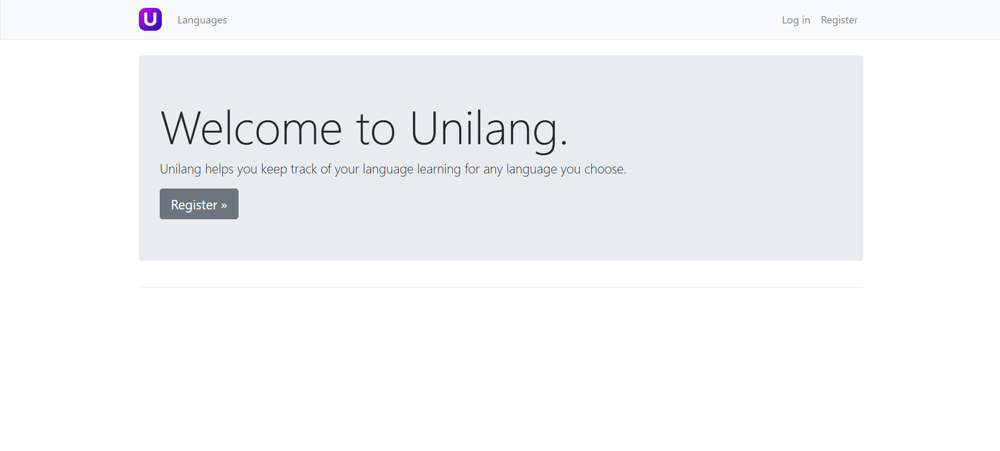

# Unilang

Unilang is a web application for learning and managing foreign languages.  
Built with **Django 5** and **Bootstrap 4**.

---

## ✨ Features

- **Language Management**
  - Add and delete different languages.
- **Vocabulary Management**
  - For each language, add words with translations.
  - Delete words when no longer needed.
- **Test Your Knowledge**
  - Interactive practice mode:
    - Words are displayed one by one.
    - Reveal translations when ready.
    - Simple and effective self-testing tool.

---

## 🛠 Tech Stack

- [Django 5](https://www.djangoproject.com/) – backend framework
- [Bootstrap 4](https://getbootstrap.com/docs/4.6/getting-started/introduction/) – frontend styling

---

## 🚀 Installation

1. Clone the repository:
   ```bash
   git clone https://github.com/prSaveliy/Unilang.git
   cd unilang
   ```

2. Create and activate a virtual environment:
    ```bash
    python -m venv .venv
    .venv/Scripts/activate
    source .venv/bin/activate  # Linux/macOS
    ```

3. Install dependencies:
    ```bash
    pip install -r requirements.txt
    ```

4. Run migrations:
    ```bash
    python manage.py migrate
    ```

5. Start the development server:
    ```bash
    python manage.py runserver
    ```

6. Open in browser:
    ```
    http://127.0.0.1:8000
    ```




## 🤝 Contributing
Contributions are welcome!
If you’d like to add features or fix bugs, feel free to fork this repo and open a pull request.